### 作者QQ：1556708905(支持修改、 部署调试、 支持代做毕设)

#### 支持代做任何毕设论、接网站建设、小程序、H5、APP、各种系统等

**毕业设计所有选题地址 [https://github.com/zhengjianzhong0107/allProject](https://github.com/zhengjianzhong0107/allProject)**

#个人记账管理系统 #java web #java #毕业设计 #ssm #课程设计 #编程 #jsp #mybatis #源代码 

## ssm  个人记账管理系统

## 一、系统介绍

用户：记账、收支管理、收支统计、收支分析、收支预算、心愿单、备忘录

管理员：用户管理、收支类别管理、新闻管理

## 二、所用技术

后端使用 ssm(spring+springmvc+mybatis)，前端使用 bootstrap 组件库配合完成开发。

## 三、环境介绍

基础环境 :IDEA/eclipse，maven3.x，JDK 1.8 ， Mysql 5.7

源码+数据库脚本 

所有项目以及源代码本人均调试运行无问题 可支持远程调试运行

## 四、页面截图

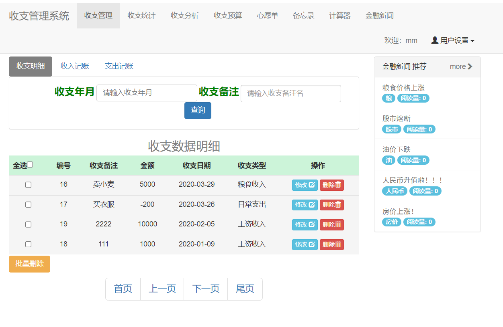

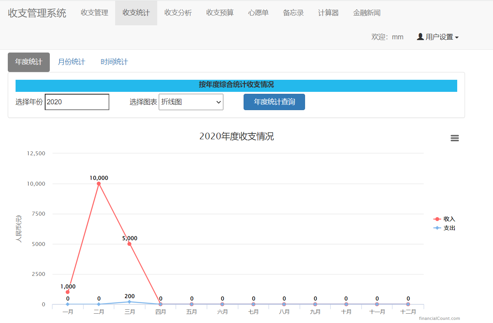

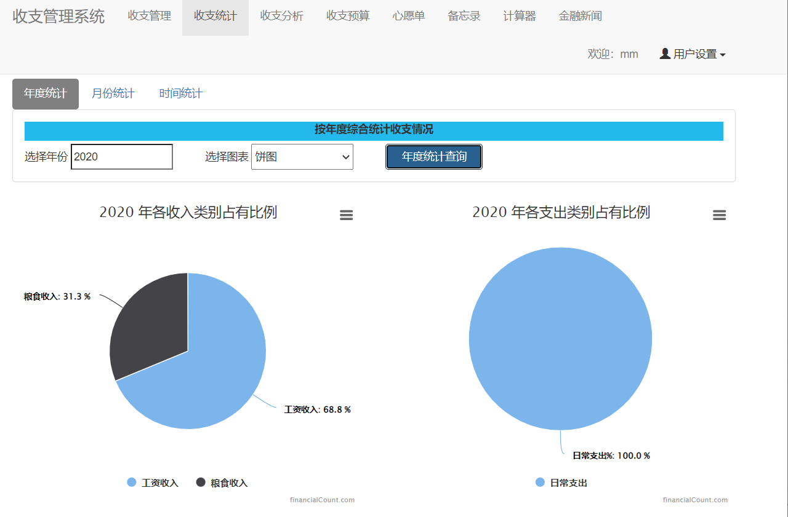

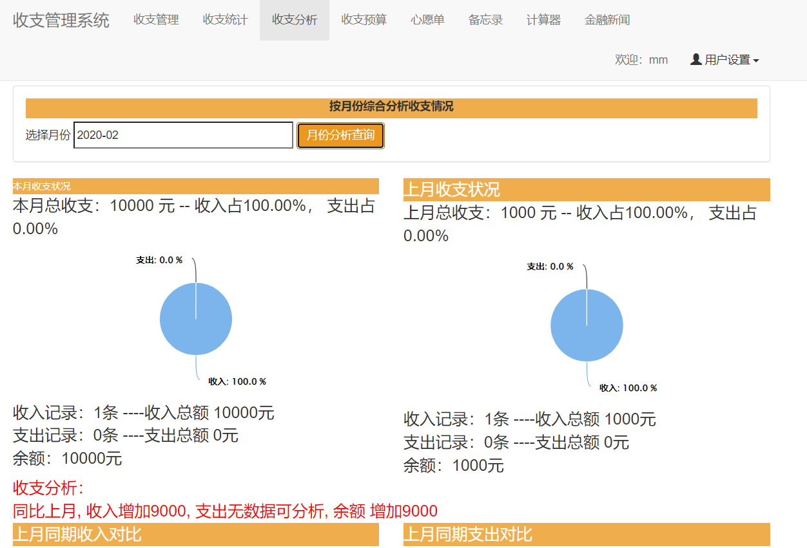

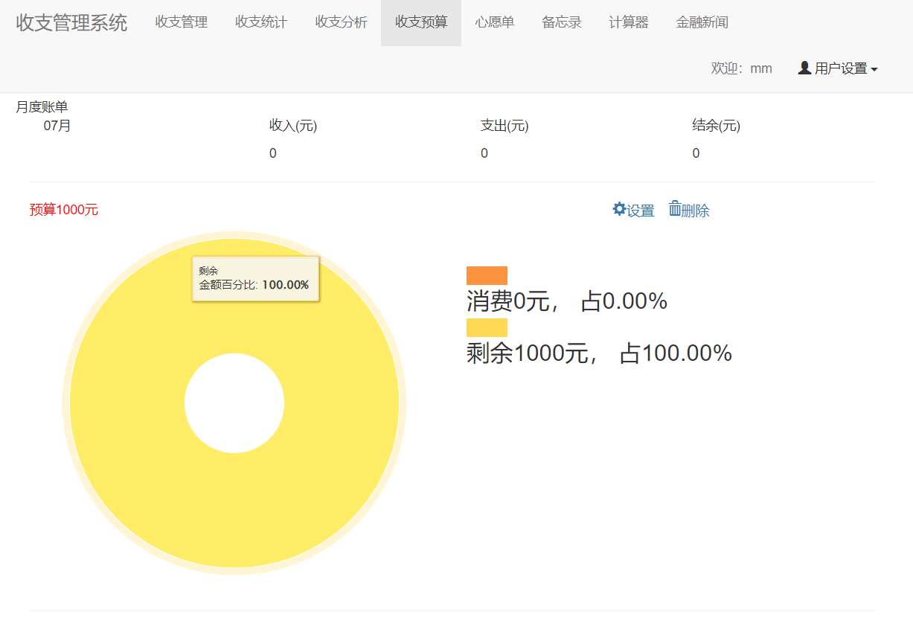

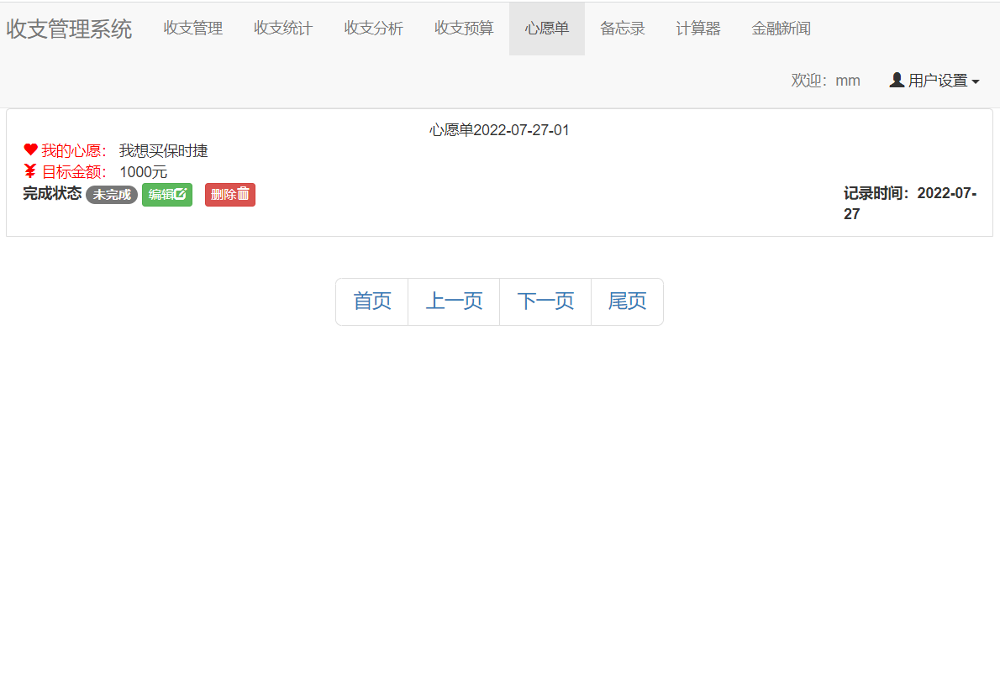

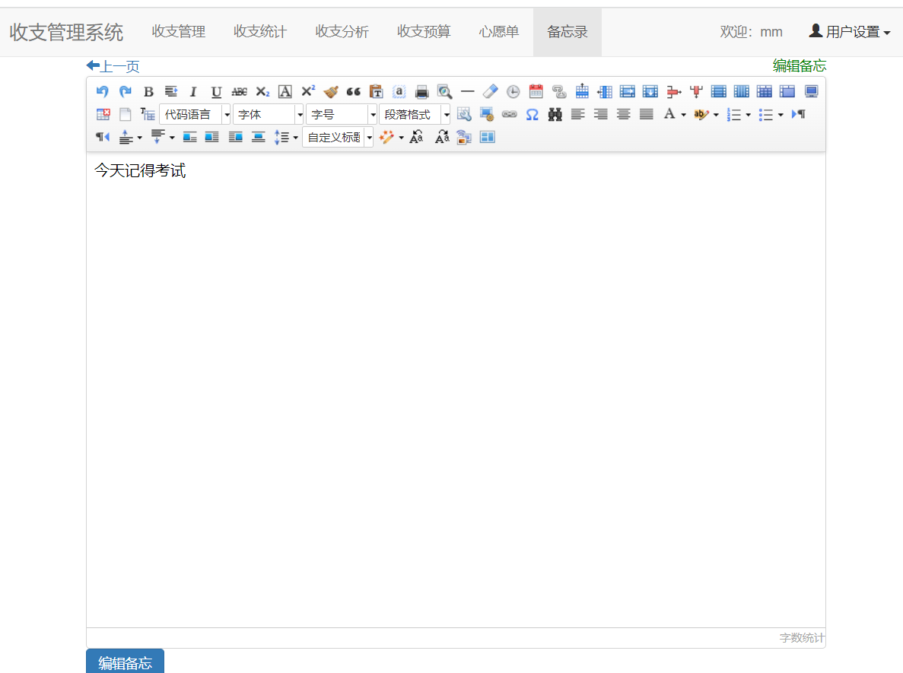

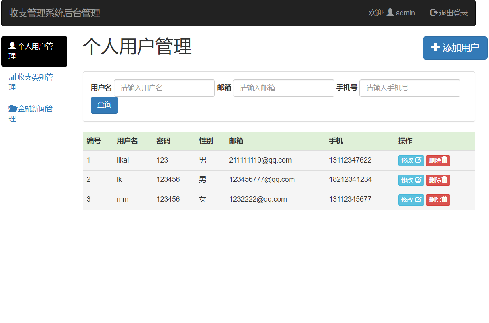

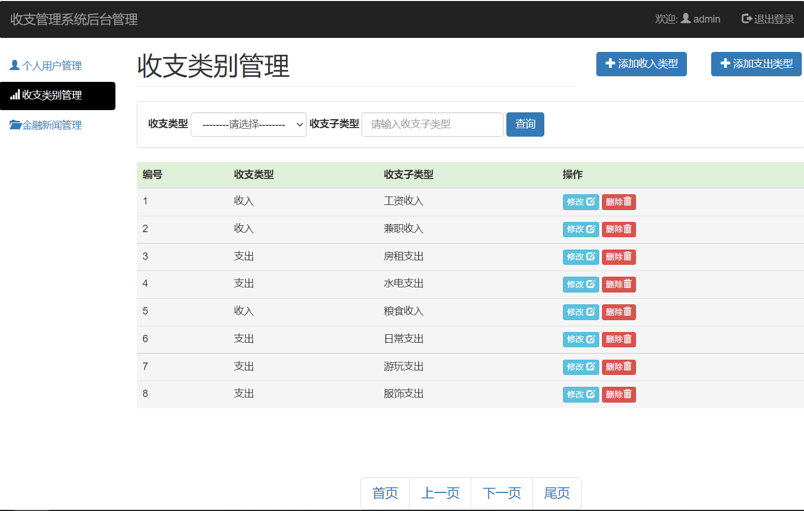

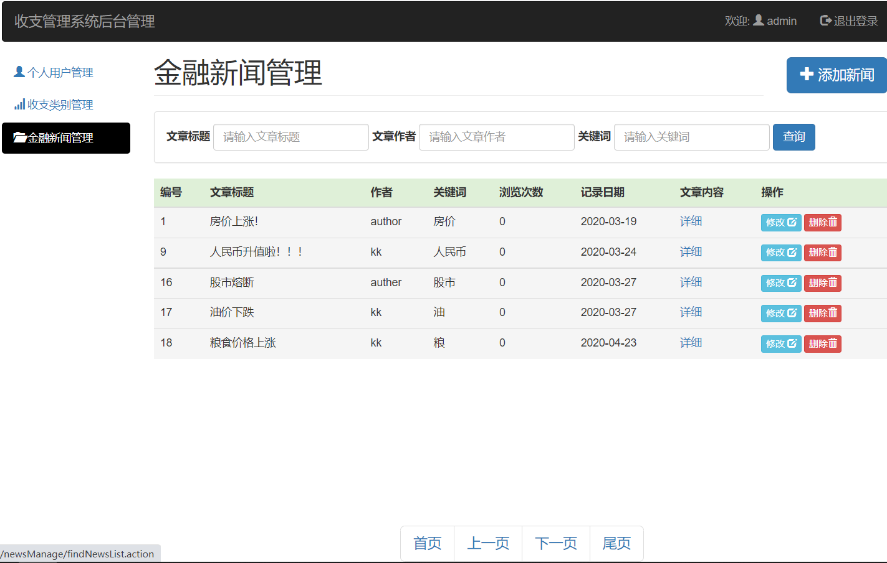

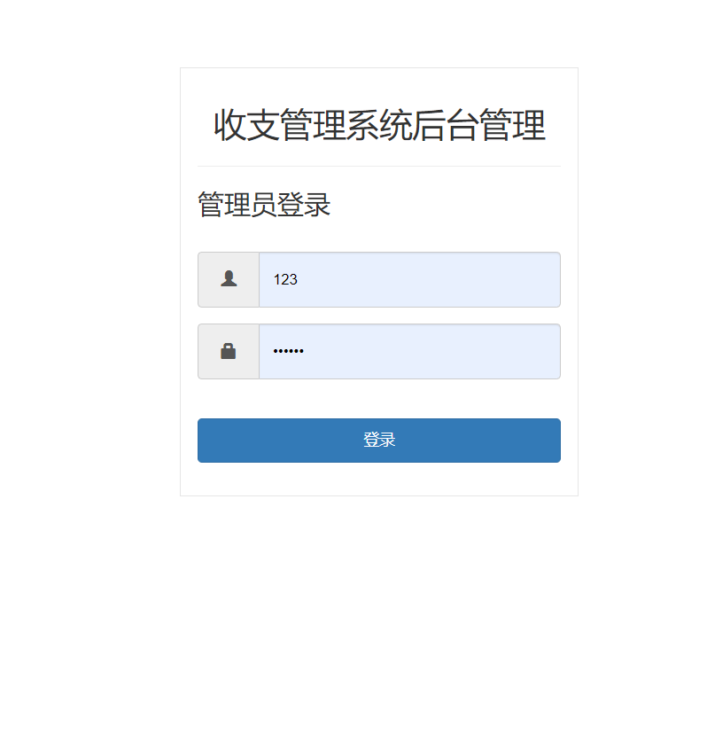

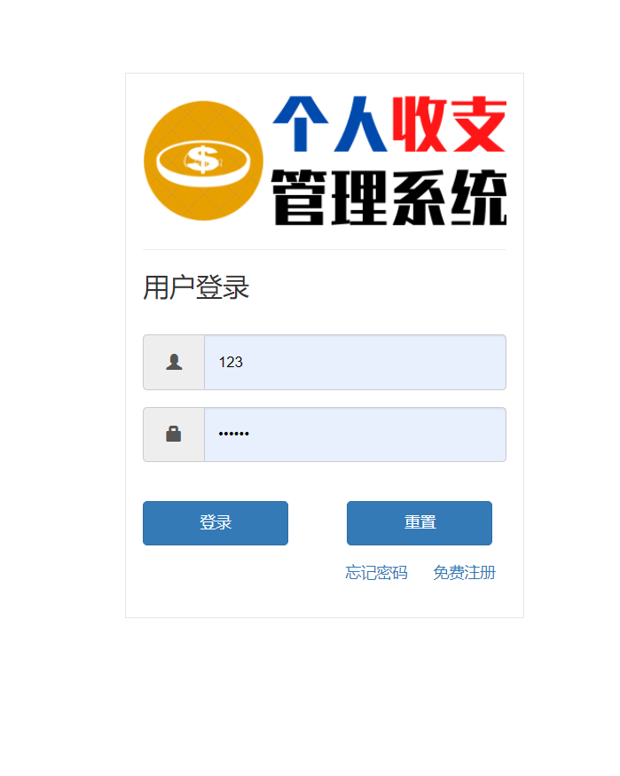

## 五、浏览地址

管理员登录：账号：admin  密码： 123456

http://localhost:8686/financialManage/userManage/logout.action

用户登录：账号：mm  密码： 123456

http://localhost:8686/financialManage/user/logout.action  

 
